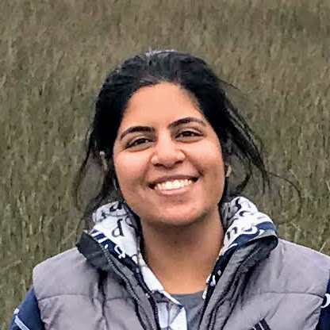

## About

I am a graduate student in the Department of Computer Science and Engineering at the [Ohio State University](https://www.osu.edu/). I'm broadly interested in applied machine learning, particularly in building and explaining deep neural models with applications in natural language processing/understanding, computational linguistics and social computing.

I completed my masters at [Cornell University](https://www.cornell.edu/) and, before that was an undergraduate at [Birla Intitute of Technology and Science, Pilani](https://www.bits-pilani.ac.in/).

---

## News

* **May 2021**: Joining [Spotify](https://www.spotify.com/) this summer as a machine learning intern
* **May 2021**: Our paper "Breaking Down the Invisible Wall of Informal Fallacies in Online Discussions" is accepted at ACL 2021
* **Apr 2021**: Our work on nowcasting epidemic incidence is now available on [arxiv](https://arxiv.org/pdf/2104.02174.pdf)
* **Jul 2020**: Our work on DrugDBEmbed is now available on [arxiv](https://arxiv.org/pdf/2007.02384.pdf)
* **May 2020**: Starting my summer internship at [CEDAR team, Inria Saclay](https://team.inria.fr/cedar/)
* **Apr 2020**: Awarded the [Global Gateway Grant](https://cgs.osu.edu/funding-opportunities/global-gateway-grant/) for research abroad
* **Aug 2019**: Awarded Graduate School's [University Fellowship](https://gradsch.osu.edu/pursuing-your-degree/graduate-fellows/university-fellowship)

---

## Publications

* **Saumya Sahai**, Oana Balalau and Roxana Horincar. ["Breaking Down the Invisible Wall of Informal Fallacies in Online Discussions."]() Proceedings of the 59th Annual Meeting of the Association for Computational Linguistics (ACL 2021)

* **Saumya Sahai&ast;**, Dravyansh Sharma*. ["Predicting and Explaining French Grammatical Gender."](https://www.aclweb.org/anthology/2021.sigtyp-1.9.pdf) The ACL Special Interest Group on Typology (NAACL 2021) (\* denotes equal contribution)

* **Saumya Sahai**, Saket Gurukar, Wasiur R. KhudaBukhsh, Srinivasan Parthasarathy and Grzegorz A. Rempala. ["A Machine Learning Model for Nowcasting Epidemic
Incidence."](https://arxiv.org/pdf/2104.02174.pdf) arXiv preprint arXiv:2104.02174 (2021)

* Bortik Bandyopadhyay, Pranav Maneriker, Vedang Patel, **Saumya Sahai**, Ping Zhang, and Srinivasan Parthasarathy. ["DrugDBEmbed: Semantic Queries on Relational Database using Supervised Column Encodings."](https://arxiv.org/pdf/2007.02384.pdf) arXiv preprint arXiv:2007.02384 (2020).

* Samuel Whitehead, Troy Shirangi, Theodore Lindsay, **Saumya Sahai**, Erica Ehrhardt, Tsevi Beatus, Nilay Yapici, Michael Dickinson, David Stern, and Itai Cohen. ["Uncovering the Neural Basis of Flight Control in Fruit Flies."](https://ui.adsabs.harvard.edu/abs/2018APS..MARS06008W/abstract)  March Meeting 2018, American Physical Society.

<!-- * **Sahai, Saumya**, Samuel Whitehead, Esther Tsyngauz, Itai Cohen,  Nilay Yapici. ["Quantitative analysis of *Drosophila* foraging and ingestion behaviors"](). (In preparation) -->

### Contact

* Email: sahai.17[AT]osu[DOT]edu
* [LinkedIn](https://www.linkedin.com/in/saumyasahai/)
* [Github](https://github.com/sahaisaumya/)
