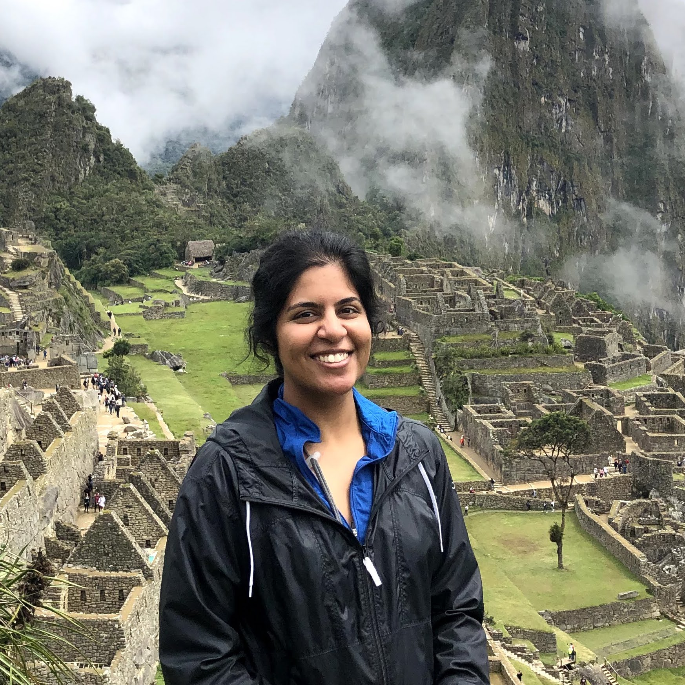

## About

I am a doctoral student in the Department of Computer Science and Engineering at the [Ohio State University](https://www.osu.edu/). My research interests are in social computing and natural language processing. I'm interested in understanding interactions among people, specially in the setting of online forums. 

I completed my masters at [Cornell University](https://www.cornell.edu/) and, before that was an undergraduate at [Birla Intitute of Technology and Science, Pilani](https://www.bits-pilani.ac.in/).

---

## News

* **Jul 2020**: Our work on DrugDBEmbed is now available on [arxiv](https://arxiv.org/pdf/2007.02384.pdf)
* **May 2020**: Starting my summer internship at [CEDAR team, Inria Saclay](https://team.inria.fr/cedar/)
* **Apr 2020**: Awarded the [Global Gateway Grant](https://cgs.osu.edu/funding-opportunities/global-gateway-grant/) for research abroad
* **Aug 2019**: Awarded Graduate School's [University Fellowship](https://gradsch.osu.edu/pursuing-your-degree/graduate-fellows/university-fellowship)

---

## Publications

* **Sahai, Saumya**, Oana Balalau and Roxana Horincar. ["Detecting fallacious arguments in conversations."]() (Submitted to ACL 2021, title changed due to ongoing blind review, manuscript available on request)

* Bandyopadhyay, Bortik, Pranav Maneriker, Vedang Patel, **Saumya Sahai**, Ping Zhang, and Srinivasan Parthasarathy. ["DrugDBEmbed: Semantic Queries on Relational Database using Supervised Column Encodings."](https://arxiv.org/pdf/2007.02384.pdf) arXiv preprint arXiv:2007.02384 (2020).

* Whitehead, Samuel, Troy Shirangi, Theodore Lindsay, **Saumya Sahai**, Erica Ehrhardt, Tsevi Beatus, Nilay Yapici, Michael Dickinson, David Stern, and Itai Cohen. ["Uncovering the Neural Basis of Flight Control in Fruit Flies."](https://ui.adsabs.harvard.edu/abs/2018APS..MARS06008W/abstract)  March Meeting of American Physical Society, Los Angeles, CA (2018): S06-008.

* **Sahai, Saumya**, Samuel Whitehead, Esther Tsyngauz, Itai Cohen,  Nilay Yapici. ["Quantitative analysis of *Drosophila* foraging and ingestion behaviors"](). (In preparation)

### Contact

* Email: sahai.17[AT]osu[DOT]edu
* [LinkedIn](https://www.linkedin.com/in/saumyasahai/)
* [Github](https://github.com/sahaisaumya/)
